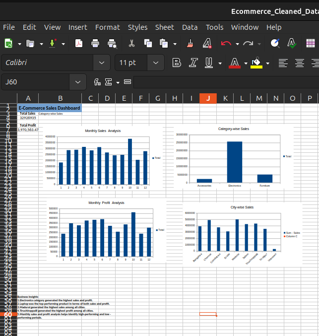

# E-Commerce Sales Analysis using LibreOffice Calc

## Project Overview

This project analyzes an e-commerce sales dataset containing around 1,000 order records.

The project focuses on data cleaning, data standardization, Pivot Table analysis, charts, dashboard creation, and business insights using LibreOffice Calc.

## Tools Used

- LibreOffice Calc
- Microsoft Excel-compatible XLSX
- GitHub

## Data Cleaning

The raw dataset was cleaned by:

- Removing duplicate Order IDs
- Handling missing City values
- Handling missing Profit and Discount values
- Standardizing city names
- Standardizing customer names
- Checking zero quantities
- Checking invalid sales values
- Verifying date and data consistency

## Analysis Performed

Pivot Tables and charts were created for:

- Category-wise Sales
- City-wise Sales
- Product-wise Sales
- Category-wise Profit
- City-wise Profit
- Product-wise Profit
- Monthly Sales
- Monthly Profit

## Dashboard

The final dashboard summarizes sales and profit performance using charts and key business insights.

## Key Business Insights

1. Electronics generated the highest sales and profit.
2. Laptop was the top-performing product in terms of both sales and profit.
3. Madurai generated the highest sales among all cities.
4. Tiruchirappalli generated the highest profit among all cities.
5. Monthly sales and profit analysis helps identify high-performing and low-performing periods.

## Project Files

- `Ecommerce_Cleaned_Dataset.xlsx` — Cleaned dataset
- `Dashboard.png` — Final analysis dashboard

## Project Outcome

This project demonstrates practical skills in data cleaning, data analysis, Pivot Tables, data visualization, dashboard creation, and deriving business insights from sales data.
